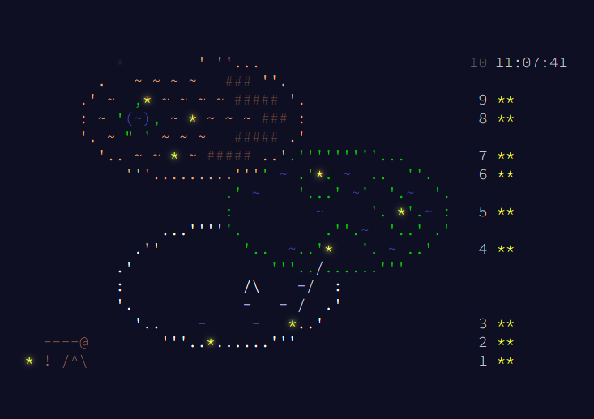

# 🎄Advent of Code 2023 🎅

Solutions for [Advent of Code][aoc-cite] programming puzzles in [C-Sharp][c-sharp-lang-repo]

Everything is self contained. No 3-rd party libraries, parsers and etc. I use only what .Net provides. Most solution setup to use Visual Studio Code.

  
  
  
  
   
  

<em><strong>Disclaimer:</strong> Solutions may contain code which can modify or delete files on disk. Use on your own risk.</em>

[aoc-cite]: https://adventofcode.com
[c-sharp-lang-repo]: https://github.com/dotnet/csharplang
