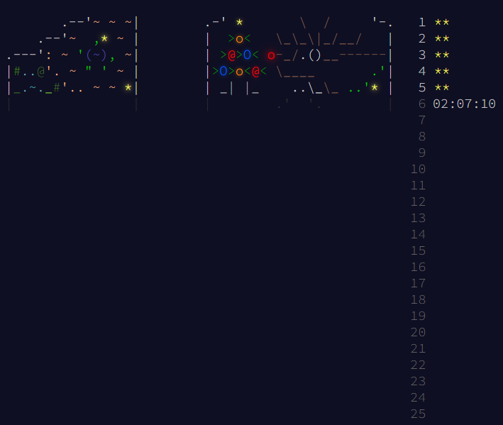

# 🎄Advent of Code 2024 🎅

Solutions for [Advent of Code][aoc-cite] programming puzzles in C

Everything is self contained. No 3-rd party libraries, parsers and etc.
I use only what standard libraries provide.

  
  
  
  
  
  

<em><strong>Disclaimer:</strong> Solutions may contain code which can modify or delete files on disk. Use on your own risk.</em>

[aoc-cite]: https://adventofcode.com
